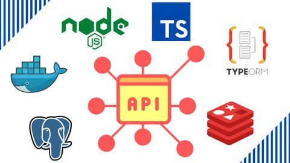

<h1 align="center">
   <a href="#" alt="">Type-orm-ts</a>
</h1>

<p align="center" style="display: flex; align-items: flex-start; justify-content: center;">
 

<h4 align="center">
 🚧Em produção🚀 🚧
</h4>

Tabela de conteúdos
=================
<!--ts-->
  * [Sobre o projeto](#-sobre-o-projeto)
  * [Layout](#-layout)
  * [Como executar o projeto](#-como-executar-o-projeto)
    * [Pré-requisitos](#pré-requisitos)
    * [Rodando o Projeto](#user-content--rodando-o-projeto)
  * [Tecnologias](#-tecnologias)

<!--te-->

## 💻 Sobre o projeto

Objetivo deste repositório é, desenvolvimento de API Restful com Node.js, Express, Typescript, TypeORM, Postgres, Redis, Docker.

Através do TypeORM e feito entidades e repositórios para cada recurso a ser consumido na API.

Aplicação backend para gestão de vendas com funcionalidades para criação de cadastro de produtos, cadastro de clientes, pedidos de compras e uma completa gestão de usuários da aplicação, com autenticação via Token JWT, recuperação de senha por email, atualização de perfil, atualização de avatar.

- A senha deve ser armazenada com criptografia;
- Não pode haver mais de um produto com o mesmo nome;
- Não pode haver um mesmo email sendo usado por mais de um usuário;


### ⚙️ Funcionalidades

Aplicaremos conceitos de boas práticas e qualidade no código, usando Design Patterns, Domain Driven Design (DDD) e Princípios SOLID, além de introduzir Testes Automatizados com o framework Jest.

Principais recursos que implementaremos no projeto:
- [X] API Restful
- [X] CORS
- [X] Tratamento de erros
- [X] Sistema de roteamento
- [X] Middlewares
- [X] CRUD
- [X] TypeORM com o padrão Repository
- [X] Migrations
- [ ] Relacionamento Many-to-Many
- [X] Filesystem/upload de arquivos
- [ ] Armazenamento de arquivos em Bucket Amazon S3
- [X] Envio de email fake (dev env) e email profissional com o Zoho Mail e Amazon SES
- [X] Autenticação JWT Token
- [ ] Cache com Redis
- [ ] Proteção contra ataque DDoS
- [ ] Design Patterns com Domain Driven Design (DDD) e Princípios SOLID
- [ ] Iniciando com Testes Automatizados com Jest
- [ ] Deploy em Produção na Digital Ocean

### Estrutura de pastas:
`config` - configurações de bibliotecas externas, como por exemplo, autenticação, upload, email, etc.

`modules` - áreas de conhecimento da aplicação, diretamente relacionados com as regras de negócios. A princípio os seguintes módulos na aplicação: customers, products, orders e users.

`shared` - módulos de uso geral compartilhados com mais de um módulo da aplicação, como por exemplo, o arquivo server.ts, o arquivo principal de rotas, conexão com banco de dados, etc.

`services` - estarão dentro de cada módulo da aplicação e serão responsáveis por todas as regras que a aplicação precisa atender, como por exemplo cadastro de clientes, cadastro de produtos, etc... e :
1 - A senha deve ser armazenada com criptografia;
2 - Não pode haver mais de um produto com o mesmo nome;
3 - Não pode haver um mesmo email sendo usado por mais de um usuário;

---

## 🎨 Layout

O layout da aplicação:

<p align="center" style="display: flex; align-items: flex-start; justify-content: center;">
 

 
</p>

<p align="center" style="display: flex; align-items: flex-start; justify-content: center;">
 

 
</p>

---

## 🚀 Como executar o projeto

### Pré-requisitos

Antes de começar, você vai precisar ter instalado em sua máquina as seguintes ferramentas:
[Node.js](https://nodejs.org/en/), [npm](https://www.npmjs.com/)

* Um sgbd que suporte uuid sugiro [DBeaver](https://dbeaver.io/download/)

* Ter conhecimento básico sobre container e [Docker](https://docs.docker.com/get-docker/)

* Ter conhecimento básico sobre [Insomia](https://insomnia.rest/download)
#### 1º Criar um arquivo `ormconfig.json` na raiz da pasta server, onde será config o banco de dados
```bash
{
  "type": "postgres",
  "host": "localhost",
  "port": 5432,
  "username": "admin",
  "password": "root",
  "database": "sales",
  "entities": [
    "./src/modules/**/typeorm/entities/*.ts"
  ],
  "migrations": [
    "./src/shared/typeorm/migrations/*.ts"
  ],
  "cli": {
    "migrationsDir":"./src/shared/typeorm/migrations"
  }
}

```
#### 2º Postgres através de container Docker
```bash
# rode esse dois comandos caso quera troca senha e nome do database, lembre-se de tambem no `ormconfig.json`
docker run \
   --name postgres \
   -e POSTGRES_USER=admin \
   -e POSTGRES_PASSWORD=root \
   -e POSTGRES_DB=sales \
   -p 5432:5432 \
   -d \
   postgres:11.5

# cria interface do pg
docker run \
   --name adminer \
   -p 8080:8080 \
   --link postgres:postgres \
   -d \
   adminer

# login interface do adminer em localhost:8080
   sistema: PostgreSQL
   servidor: postgres
   usuário: admin
   senha: root
   base de dados: sales

# Excluir images,container,volumes ou tudo
  docker system prune --all --force --volumes

```

#### 🎲 Rodando o projeto

```bash

#1 Instale as dependências e pastas na raiz do projeto em um terminal:
yarn
yarn add -D tsconfig-paths
npx tsc

#2 verificar o banco de dado esta criado corretamente e conectado !!!
A biblioteca do TypeORM recebeu uma nova versão recentemente e algumas configurações ficaram incompatíveis com o conteúdo, como por exemplo, o uso do CLI para rodar as migrações, o método com as configurações de conexão com o servidor de banco de dados, além de outras coisas.
Caso a versão instalada em seu projeto seja a partir de 0.3.x, recomendo usar a mesma versão do repositório a versão 0.2.29
Para abrir o TypeORM help, use o comando: yarn typeorm

#3 start na api:
em um  terminal rode: yarn dev

#4 comando para criar coluna e tabelas no banco de dados, em um terminal rode:
yarn typeorm migration:run

#5 verificar api com insomnia:
abra insonima e importe rotas do projeto typeorm-ts
no insomia atualize o token, pois dura 1 dia com a rota 'auth' teste as funções com CRUD, por exemplo


```
---
## 🛠 Tecnologias

Principais tecnologias que utilizaremos para desenvolvimento da API:

Node.js, Express, Typescript, TypeORM, Postgres através de container Docker, Redis através de container Docker, Amazon S3, Amazon SES

* Construir API Restful Javascript Node com Express e Typescript
* Implementar o TypeORM em projetos Node com Postgres
* Configurar cache na API com o Redis
* Usar o Docker em ambiente de desenvolvimento
* Realizar o deploy em produção com servidor na Digital Ocean
* Qualidade em código com Design Patterns, Domain Driven Design (DDD) e Princípios SOLID
* Testes Automatizados com o framework Jest


#### Na parte do Server foram utilizadas as seguintes bibliotecas:

```bash
    "bcryptjs": para criptografia de senha
    "celebrate": para validação de dados
    "cors": para permitir acesso a api de outros domínios
    "date-fns": para tratar datas
    "express": para criar aplicação
    "express-async-errors": para tratar erros de async
    "handlebars": para criar templates
    "jsonwebtoken": para gerar token
    "multer": para upload de arquivos
    "nodemailer": para enviar email
    "pg": para conexão com o banco de dados
    "reflect-metadata": para criar metadados
    "typeorm":para conexão com o banco de dados

```
